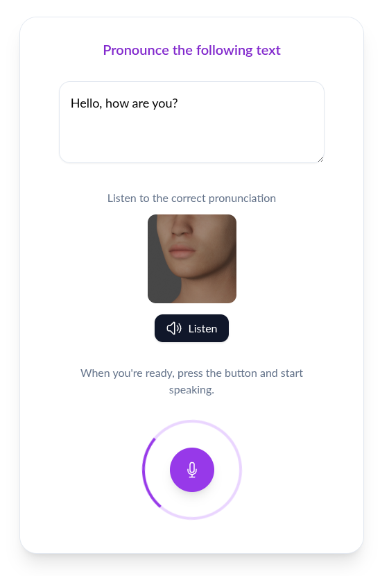

This project provides tools for analyzing and improving English pronunciation using AI models. It includes a web application and a command-line interface (CLI) for comparing audio files against expected text, providing detailed feedback on phonemes and prosody, and visualizing visemes. It leverages Wav2Vec 2.0 for audio feature extraction and DTW for phoneme alignment.

See my [blog post](https://blog.lepine.pro/en/ai-wav2vec-pronunciation-vectorization/) for more details about the approach.

## Installation

```bash
pip install -r requirements.txt
python -m spacy download en_core_web_sm
```

## Usage

### As library

```python
import audio
import speech


audio_path = "example.mp3"
expected_text = "Hello I am a developer"

sound = audio.load(audio_path)
json = speech.compare_audio_with_text(sound, expected_text)
print(json)
```

### As CLI

```bash
python cli.py <file.mp3 or file.wav> "Expected text"
```

### Predicted output

You will get JSON with the following fields:

**Phonemes**

+ `score`: [0-100] pronunciation score
+ `differences.phoneme_distance`: DTW distance between expected and predicted phonemes
+ `differences.phonemes`: list of phonemes with their start and end time,
+ `differences.errors`: array of errors, with:
  - `position`: index of the word in the expected text
  - `expected`: expected phonemes
  - `actual`: predicted phonemes
  - `word`: the expected word

  For example, an error can be:
  ```json
  {
      "position": 0,
      "expected": "hæloʊ",
      "actual": "hɛl",
      "word": "Hell"
  },
  ```
+ `transcribe`: the transcription of the audio

**Prosody**

You also get prosody information, with:

+ `prosody.f0`: the fundamental frequency (pitch) contour
+ `prosody.energy`: the energy (loudness) contour


## Web application

Mount the server:

```
python -m uvicorn server:app --host 0.0.0.0 --port 8000 --reload
```



This application comes with a basic [phoneme to viseme](static/viseme.js) javascript implementation, for English language. An better implementation could be done using [dedicated models](https://github.com/Magicboomliu/Viseme-Classification).


# References

- [Vectorisation of sounds for pronunciation](https://blog.lepine.pro/en/ai-wav2vec-pronunciation-vectorization/)
- [Visemes](https://learn.microsoft.com/fr-fr/azure/ai-services/speech-service/how-to-speech-synthesis-viseme?tabs=visemeid&pivots=programming-language-csharp), 
- [Visemes SSML](https://learn.microsoft.com/fr-fr/azure/ai-services/speech-service/speech-ssml-phonetic-sets)

# Visemes

The viseme images come from the HumanBeanCMU39 viseme set.

# License

This project is licensed under the MIT License - see the [LICENSE](LICENSE) file for details.