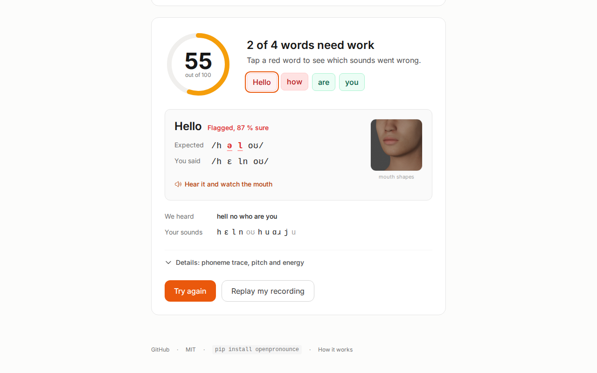

<h1 align="center">OpenPronounce</h1>

<p align="center">
  <b>Open-source, phoneme-level English pronunciation assessment.</b><br>
  Give it a recording and the sentence that was supposed to be said. Get a score, the mispronounced words with expected vs. heard phonemes (IPA), the transcription and the prosody curves. Runs on your machine, on CPU.
</p>

<p align="center">
  <a href="https://colab.research.google.com/github/Halleck45/OpenPronounce/blob/main/OpenPronounce-demo.ipynb"></a>
  <a href="https://github.com/Halleck45/OpenPronounce/actions/workflows/tests.yml"></a>
  <a href="https://opensource.org/licenses/MIT"></a>
  <a href="https://github.com/sponsors/Halleck45"></a>
</p>

<p align="center">
  
</p>

```console
$ openpronounce recording.wav "Hello, how are you?"
Score        : 34.9/100
Transcription: HELL NO WHO ARE YOU
Mispronounced:
  - Hello: expected /həloʊ/, heard /noʊ/
  - how: expected /haʊ/, heard /huː/
```

Commercial APIs (Azure Speech *Pronunciation Assessment*, SpeechAce, ELSA...) do this behind a paywall and a network call. OpenPronounce is the self-hosted, MIT-licensed building block for language-learning apps, EdTech products and research: no API key, no per-minute billing, your learners' voices stay on your servers.

## What you get

For each recording, a JSON-serializable dict:

| Field | Meaning |
|---|---|
| `score` | 0-100 overall pronunciation score |
| `transcribe` | what the model actually heard (Wav2Vec2 CTC) |
| `differences.errors[]` | one entry per mispronounced or missing word: `word`, `expected` (IPA), `actual` (IPA), `actual_word` |
| `differences.words_with_errors` | the words to work on |
| `differences.phoneme_error_rate`, `differences.word_error_rate` | edited phonemes / expected phonemes, edited words / expected words |
| `differences.expected_phonemes`, `differences.transcribed_phonemes` | full phoneme sequences |
| `differences.expected_vector`, `differences.transcribed_vector` | DTW-aligned phoneme traces, ready to plot |
| `acoustic_distance` | mean per-frame DTW distance between the learner's Wav2Vec2 embeddings and a synthetic reference |
| `prosody.f0`, `prosody.energy` | pitch and loudness contours |

## Quickstart

### Install

Requires Python 3.10+, `ffmpeg` and `espeak-ng` on the system (`apt install ffmpeg espeak-ng`, `brew install ffmpeg espeak-ng`).

```bash
pip install torch --index-url https://download.pytorch.org/whl/cpu   # CPU wheels, much smaller
pip install git+https://github.com/Halleck45/OpenPronounce.git
```

The Wav2Vec2 model (`facebook/wav2vec2-large-960h`, ~1.2 GB) is downloaded from the Hugging Face Hub on first use.

### Command line

```bash
openpronounce recording.wav "Hello, I am a developer"
openpronounce recording.mp3 "Hello, I am a developer" --json --no-prosody   # machine-readable
```

### Python

```python
from openpronounce import load_audio, compare_audio_with_text

sound = load_audio("recording.wav")          # any format ffmpeg reads, resampled to 16 kHz mono
result = compare_audio_with_text(sound, "Hello, I am a developer")

print(result["score"])                       # 97.36
for err in result["differences"]["errors"]:
    print(err["word"], err["expected"], "->", err["actual"] or "(missing)")
```

Lower-level building blocks are exposed too: `transcribe(sound)`, `get_phonemes(text)`, `compare_transcriptions(heard_text, expected_text)`.

### Docker

```bash
docker build -t openpronounce .
docker run -p 8000:8000 openpronounce
# open http://localhost:8000
```

### Web application (FastAPI)

```bash
pip install "openpronounce[app] @ git+https://github.com/Halleck45/OpenPronounce.git"
git clone https://github.com/Halleck45/OpenPronounce.git && cd OpenPronounce
uvicorn server:app --host 0.0.0.0 --port 8000
```

The UI records from the microphone, scores the sentence, animates a mouth (visemes) and plots the phoneme traces and prosody. Browsers only allow microphone access on `https://` or `localhost`.

| Endpoint | Body (multipart form) | Returns |
|---|---|---|
| `POST /pronunciation` | `file`, `expected_text` | full analysis (see above) |
| `POST /speech2text` | `file` | `{"transcript": ...}` |
| `POST /phonemes` | `text` | `{"phonemes": [...], "words": [...]}` |
| `POST /tts` | `text` | reference pronunciation, 16 kHz wav |
| `GET /health` | | `{"status": "ok"}` |

Interactive docs at `/docs` (Swagger UI).

### Streamlit

```bash
streamlit run streamlit_app.py
```

### Notebook

[Open in Colab](https://colab.research.google.com/github/Halleck45/OpenPronounce/blob/main/OpenPronounce-demo.ipynb): load a sample, score it, print the phoneme errors, plot the prosody, then try your own recording. No local setup.

## How it works

1. **Reference**: the expected sentence is synthesized (gTTS) and both recordings are encoded with Wav2Vec2. The two embedding sequences are aligned with DTW; the mean per-frame distance is the `acoustic_distance`.
2. **Transcription**: the learner's audio is transcribed with the Wav2Vec2 CTC head.
3. **Phonemes**: expected text and transcription are phonemized (espeak-ng, IPA) word by word.
4. **Alignment**: expected and heard phoneme sequences are aligned (edit-distance opcodes), and each expected word is compared with the phonemes it aligned to. A word whose phonemes differ by more than 40 % is reported, with what was heard instead.
5. **Prosody**: F0 (pYIN) and RMS energy contours.

The approach is described in [this blog post](https://blog.lepine.pro/en/ai-wav2vec-pronunciation-vectorization/).

### The score

`score = 0.2 × acoustic + 0.5 × (1 − phoneme error rate) + 0.3 × (1 − word error rate)`, each term clipped to [0, 100].
The acoustic term maps the mean DTW distance linearly from 5 (100) to 15 (0); these bounds come from the bundled samples (`assets/`) and are exposed as `speech.ACOUSTIC_DISTANCE_GOOD` / `speech.ACOUSTIC_DISTANCE_BAD` if you want to recalibrate on your own data. All three terms are length-independent, so a long paragraph and a two-word sentence are scored on the same scale.

## Visemes

The web UI ships a small [phoneme-to-viseme](static/viseme.js) mapping for English (HumanBeanCMU39 mouth shapes), enough to animate a talking mouth from the phoneme list:

```javascript
import { Viseme } from "/static/viseme.js";
const viseme = new Viseme(document.getElementById("mouth"));
viseme.play(["həloʊ", "huː", "ɑːɹ", "juː"]);
```

## Limitations

- English only for now (`en-us` phonemization, English Wav2Vec2). Swapping the model and the espeak language is the path to other languages.
- The reference voice comes from gTTS, so the first analysis of a given sentence needs network access; references are cached afterwards.
- Wav2Vec2 was trained on native read speech (LibriSpeech). Very strong accents, children's voices and noisy recordings degrade the transcription, and therefore the feedback.
- Word-level errors depend on the ASR: a phoneme the model "corrects" while decoding will not be reported. This is a heuristic assessment, not a Goodness-of-Pronunciation model trained on annotated L2 speech.

## Roadmap

Contributions welcome on any of these:

- [ ] Publish on PyPI (`pip install openpronounce`)
- [ ] Hosted demo (Hugging Face Space)
- [ ] Offline TTS reference (piper / Kokoro) instead of gTTS
- [ ] Phoneme-level model (`wav2vec2-lv-60-espeak-cv-ft` or similar) to report errors inside a word without relying on word transcription
- [ ] Other languages
- [ ] Benchmark on a public L2 dataset (speechocean762) to calibrate the score
- [ ] GPU support in the Docker image

## Contributing

```bash
git clone https://github.com/Halleck45/OpenPronounce.git && cd OpenPronounce
python -m venv .venv && source .venv/bin/activate
pip install torch --index-url https://download.pytorch.org/whl/cpu
pip install -e ".[app,dev]"
pytest
```

Tests do not need the network nor the model weights (model calls are mocked); espeak-ng must be installed.

## References

- [Vectorisation of sounds for pronunciation](https://blog.lepine.pro/en/ai-wav2vec-pronunciation-vectorization/) (blog post about this project)
- [wav2vec 2.0](https://ai.meta.com/research/impact/wav2vec/), Baevski et al., 2020
- [Azure Speech visemes](https://learn.microsoft.com/azure/ai-services/speech-service/how-to-speech-synthesis-viseme) and [SSML phonetic sets](https://learn.microsoft.com/azure/ai-services/speech-service/speech-ssml-phonetic-sets)
- Mouth images: HumanBeanCMU39 viseme set

## License

MIT, see [LICENSE](LICENSE).
