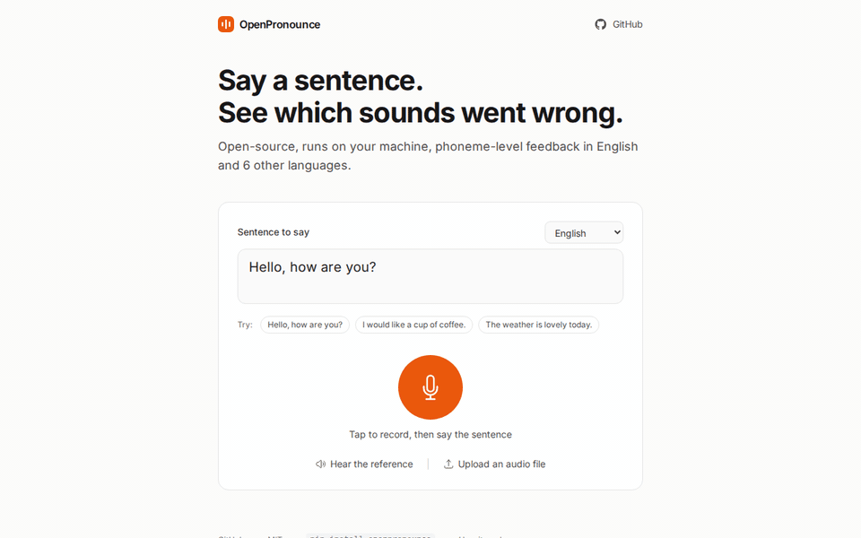

<h1 align="center">OpenPronounce</h1>

<p align="center">
  <b>Open-source, phoneme-level pronunciation assessment.</b><br>
  Give it a recording and the sentence that was supposed to be said. Get a score, the mispronounced words with expected vs. heard phonemes (IPA), the transcription and the prosody curves. Runs on your machine, on CPU. English by default; French, Spanish, German, Italian, Portuguese and Dutch are supported experimentally.
</p>

<p align="center">
  <a href="https://colab.research.google.com/github/Halleck45/OpenPronounce/blob/main/OpenPronounce-demo.ipynb"></a>
  <a href="https://pypi.org/project/openpronounce/"></a>
  <a href="https://github.com/Halleck45/OpenPronounce/actions/workflows/tests.yml"></a>
  <a href="https://opensource.org/licenses/MIT"></a>
  <a href="https://github.com/sponsors/Halleck45"></a>
</p>

<p align="center">
  
</p>

```console
$ openpronounce recording.wav "Hello, how are you?"
Score        : 59.0/100
Transcription: HELL NO WHO ARE YOU
Heard phones : /h ɛ l n oʊ h u ɑɹ j u/
Mispronounced:
  - hello: expected /həloʊ/, heard /hɛlnoʊ/ (confidence 89%)
  - how: expected /haʊ/, heard /hu/ (confidence 50%)
```

Commercial APIs (Azure Speech *Pronunciation Assessment*, SpeechAce, ELSA...) do this behind a paywall and a network call. OpenPronounce is the self-hosted, MIT-licensed building block for language-learning apps, EdTech products and research: no API key, no per-minute billing, your learners' voices stay on your servers.

## What you get

For each recording, a JSON-serializable dict:

| Field | Meaning |
|---|---|
| `score` | 0-100 overall pronunciation score |
| `transcribe` | what the model actually heard (Wav2Vec2 CTC) |
| `differences.errors[]` | one entry per mispronounced or missing word: `word`, `expected` (IPA), `actual` (IPA, what was really heard), `position`, `confidence` (0-1, how sure we are the word is wrong) and `phones[]` (`expected`, `heard`, `confidence` per phone, to highlight the wrong one) |
| `differences.heard_phones`, `differences.heard_phones_confidence`, `differences.expected_phones` | the phones recognized in the audio with their posterior (0-1), and the phones expected for each word |
| `differences.words_with_errors` | the words to work on |
| `differences.phoneme_error_rate`, `differences.word_error_rate` | edited phonemes / expected phonemes, edited words / expected words |
| `differences.expected_phonemes`, `differences.transcribed_phonemes` | full phoneme sequences |
| `differences.expected_vector`, `differences.transcribed_vector` | DTW-aligned phoneme traces, ready to plot |
| `acoustic_distance` | mean per-frame DTW distance between the learner's Wav2Vec2 embeddings and a synthetic reference |
| `prosody.f0`, `prosody.energy` | pitch and loudness contours |

## Quickstart

### Install

Requires Python 3.10+, `ffmpeg` and `espeak-ng` on the system (`apt install ffmpeg espeak-ng`, `brew install ffmpeg espeak-ng`).

```bash
pip install torch --index-url https://download.pytorch.org/whl/cpu   # CPU wheels, much smaller
pip install openpronounce
```

Two Wav2Vec2 checkpoints (~1.2 GB each) are downloaded from the Hugging Face Hub on first use: `facebook/wav2vec2-large-960h` (words) and `facebook/wav2vec2-lv-60-espeak-cv-ft` (phones). Set `OPENPRONOUNCE_PHONEME_MODEL=off` to skip the second one; word errors are then inferred from the transcription, which is less precise.

### Command line

```bash
openpronounce recording.wav "Hello, I am a developer"
openpronounce recording.mp3 "Hello, I am a developer" --json --no-prosody   # machine-readable
openpronounce bonjour.wav "Bonjour, je suis développeur" --lang fr           # other languages, see below
```

### Python

```python
from openpronounce import load_audio, compare_audio_with_text

sound = load_audio("recording.wav")          # any format ffmpeg reads, resampled to 16 kHz mono
result = compare_audio_with_text(sound, "Hello, I am a developer")

print(result["score"])                       # 98.93
for err in result["differences"]["errors"]:
    print(err["word"], err["expected"], "->", err["actual"] or "(missing)")
```

Lower-level building blocks are exposed too: `transcribe(sound)`, `get_phonemes(text)`, `compare_transcriptions(heard_text, expected_text)`.
Every function takes an optional `lang="en"`; `compare_audio_with_text(sound, "Bonjour le monde", lang="fr")` selects the French TTS voice, phonemizer and word transcription model.

### Languages

English (`en`) is the default and the only calibrated language. `fr`, `es`, `de`, `it`, `pt` and `nl` are experimental: the phone recognizer (`wav2vec2-lv-60-espeak-cv-ft`) is multilingual, but the word transcription models are community XLSR checkpoints (`jonatasgrosman/wav2vec2-large-xlsr-53-*`, ~1.2 GB each, downloaded on first use) and the score is only partly calibrated for them (the acoustic baseline is, the phone thresholds are not). `openpronounce.LANGUAGES` lists the registry, `get_language(code)` raises `ValueError` on unknown codes.

### Docker

```bash
docker build -t openpronounce .
docker run -p 8000:8000 openpronounce
# open http://localhost:8000
```

GPU (needs the NVIDIA Container Toolkit): `docker build -f Dockerfile.gpu -t openpronounce:gpu . && docker run --gpus all -p 8000:8000 openpronounce:gpu`. Outside Docker, models run on CUDA when `torch.cuda.is_available()`; force a device with `OPENPRONOUNCE_DEVICE=cpu|cuda|cuda:1|mps`.

### Web application (FastAPI)

```bash
git clone https://github.com/Halleck45/OpenPronounce.git && cd OpenPronounce
pip install -e ".[app]"
uvicorn server:app --host 0.0.0.0 --port 8000
```

The UI records from the microphone (or takes a file), scores the sentence, shows each word with the wrong phones highlighted and how sure we are, animates a mouth (visemes) and plots the phoneme traces and prosody. Browsers only allow microphone access on `https://` or `localhost`.

| Endpoint | Body (multipart form) | Returns |
|---|---|---|
| `POST /pronunciation` | `file`, `expected_text`, `lang` (optional, default `en`) | full analysis (see above) |
| `POST /speech2text` | `file`, `lang` (optional) | `{"transcript": ...}` |
| `POST /phonemes` | `text`, `lang` (optional) | `{"phonemes": [...], "words": [...]}` |
| `POST /tts` | `text`, `lang` (optional) | reference pronunciation, 16 kHz wav |
| `GET /languages` | | `{"default": "en", "languages": [{"code": ..., "name": ...}]}` |
| `GET /health` | | `{"status": "ok"}` |

An unknown `lang` is rejected with a 422 listing the supported codes.

Interactive docs at `/docs` (Swagger UI).

### Notebook

[Open in Colab](https://colab.research.google.com/github/Halleck45/OpenPronounce/blob/main/OpenPronounce-demo.ipynb): load a sample, score it, print the phoneme errors, plot the prosody, then try your own recording. No local setup.

## How it works

1. **Phones**: a Wav2Vec2 model fine-tuned on espeak labels (`wav2vec2-lv-60-espeak-cv-ft`) recognizes the phones actually said, straight from the audio. No word-level language model gets a chance to "correct" the learner.
2. **Expected phones**: the sentence is phonemized with espeak-ng (IPA) in the selected language, word by word. Both sequences are normalized (length marks dropped, repetitions collapsed; for English also reduced vowels merged, cot-caught merger, a few function words with alternate pronunciations).
3. **Alignment and confidence**: expected and heard phones are aligned with edit-distance opcodes and each word is compared with the phones it aligned to. Every wrong phone gets an error confidence from the CTC posteriors: 1 for a clear substitution, deletion or insertion, half for a close substitution (voicing, tense/lax vowel...), less for a dropped or extra phone at the end of a word, and scaled down (Goodness-of-Pronunciation style) when the expected phone was itself plausible in the frames where it should have been. A word is reported when these confidences add up to 40 % of its phones or to 2 phones. Constants: `phones.PHONE_ERROR_THRESHOLD`, `phones.PHONE_ERROR_MIN_EDITS`, `phones.NEAR_PHONE_COST`, `phones.PHONE_PLAUSIBLE_POSTERIOR`; calibration in [benchmarks/README.md](benchmarks/README.md#word-level-detection).
4. **Words**: the audio is also transcribed with `wav2vec2-large-960h` (English) or a language-specific XLSR checkpoint for the transcription and the word error rate.
5. **Acoustics**: the sentence is synthesized (see [Reference voice](#reference-voice)), both recordings are encoded with Wav2Vec2 and aligned with DTW; the mean per-frame distance is the `acoustic_distance`.
6. **Prosody**: F0 (pYIN) and RMS energy contours.

The approach is described in [this blog post](https://blog.lepine.pro/en/ai-wav2vec-pronunciation-vectorization/).

### The score

`score = 0.3 × acoustic + 0.4 × (1 − phoneme error rate) + 0.3 × (1 − word error rate)`, each term clipped to [0, 100].
The acoustic term maps the mean DTW distance linearly from 6 (100) to 15 (0) in English; the bounds are exposed as `speech.ACOUSTIC_DISTANCE_GOOD` / `speech.ACOUSTIC_DISTANCE_BAD` and the weights as `speech.SCORE_WEIGHTS` if you want to recalibrate on your own data. All three terms are length-independent, so a long paragraph and a two-word sentence are scored on the same scale. The embeddings come from an English checkpoint, which puts two native voices of another language further apart (9 to 13 instead of ~6.5), so each language carries its own "good" distance (`Language.acoustic_good`, measured between gTTS and Piper voices); the 9-point good-to-bad span is shared.

Weights and bounds were calibrated against human ratings: Spearman ρ = 0.65 with the expert total score on 500 speechocean762 utterances (0.83 once averaged per speaker), see [benchmarks/](benchmarks/README.md). A heavier acoustic weight would correlate a little better on that corpus (0.68) but would no longer punish a wrong sentence, so the phone and word terms keep most of the weight: a learner who says the wrong word must lose points.

### Reference voice

The acoustic term needs a native reading of the expected sentence: it is synthesized once per sentence, encoded with Wav2Vec2 like the learner's recording, and cached under `$OPENPRONOUNCE_CACHE_DIR` (system temp dir by default). Three synthesizers are available, chosen with the `OPENPRONOUNCE_TTS` environment variable (or `audio.text2speech(..., backend=...)`):

| `OPENPRONOUNCE_TTS` | Engine | Install | Offline | Download |
|---|---|---|---|---|
| `gtts` (default) | Google Translate TTS | included | no: network on the first analysis of each sentence, cached afterwards | none |
| `piper` | [Piper](https://github.com/OHF-Voice/piper1-gpl) (VITS, ONNX, CPU) | `pip install openpronounce[tts-piper]` | yes, after the first voice download | ~60 MB per medium voice, from `rhasspy/piper-voices` |
| `kokoro` | [Kokoro-82M](https://huggingface.co/hexgrad/Kokoro-82M) (PyTorch) | `pip install openpronounce[tts-kokoro]` | yes, after the first model download | ~330 MB model + a few MB per voice (+ the spaCy `en_core_web_sm` model, fetched on first use for English) |

`OPENPRONOUNCE_TTS_VOICE` (or `voice=`) selects the voice: a Piper voice id such as `en_US-lessac-medium` (default) or `en_GB-cori-medium`, a Kokoro voice such as `af_heart` (default) or `bf_emma`, or, for gTTS, the Google domain that sets the accent (`com`, `co.uk`, `com.au`). Piper and Kokoro ship a default voice for the languages they cover (`openpronounce.tts.PIPER_DEFAULT_VOICES`, `openpronounce.tts.KOKORO_LANGUAGES`); models and voices land in the Hugging Face cache (`$HF_HOME`), so `HF_HUB_OFFLINE=1` works once they are there. The reference cache is keyed by backend and voice, so switching engines does not serve stale references.

For self-hosting we recommend Piper: no network at all, small, fast on CPU, and no PyTorch model to load next to Wav2Vec2. Kokoro sounds more natural but costs ~330 MB and a few seconds of warm-up. On the bundled samples the acoustic distance stays on the gTTS scale with Kokoro (6.2 / 11.6 / 10.3 for `developer.wav`, `developer1.wav`, `harvard.wav` versus 6.3 / 11.4 / 10.1 with gTTS) and shifts up by 1 to 2 with Piper on good readings (8.2 / 11.9 / 11.0), which lowers the acoustic term slightly (a 30 % weight in the score) until it is recalibrated for that engine.

## Visemes

The web UI ships a small [phoneme-to-viseme](static/viseme.js) mapping for English (HumanBeanCMU39 mouth shapes), enough to animate a talking mouth from the phoneme list:

```javascript
import { Viseme } from "/static/viseme.js";
const viseme = new Viseme(document.getElementById("mouth"));
viseme.play(["həloʊ", "huː", "ɑːɹ", "juː"]);
```

## Limitations

- Only English is calibrated against human ratings. Other languages reuse the English phone thresholds and score weights (only the acoustic baseline is per language), the acoustic embeddings always come from the English checkpoint, and their word transcription relies on community XLSR models.
- With the default gTTS reference voice, the first analysis of a given sentence needs network access (references are cached afterwards). Set `OPENPRONOUNCE_TTS=piper` or `kokoro` for a fully offline setup, see [Reference voice](#reference-voice).
- Wav2Vec2 was trained on native read speech (LibriSpeech). Very strong accents, children's voices and noisy recordings degrade the transcription, and therefore the feedback.
- The phone recognizer itself has an error rate (about 10 % of phones on a clean native reading of the bundled Harvard sentences); expect an occasional false alarm on short words. On speechocean762 (Mandarin learners, many children) one flagged word in five is rated as mispronounced by the human raters, for seven in ten of the words they reject; the rest are accent traits the raters accept, alignment slips on short function words and recognizer errors. This is a heuristic assessment calibrated on that corpus, not a Goodness-of-Pronunciation model trained on annotated L2 speech.

## Roadmap

Contributions welcome on any of these:

- [x] Publish on PyPI (`pip install openpronounce`)
- [ ] Hosted demo (Docker image is ready, `scripts/sync_space.sh` pushes it to a Hugging Face Space)
- [x] Offline TTS reference (Piper / Kokoro), `OPENPRONOUNCE_TTS`
- [x] Per-phone confidence (CTC posteriors) to grade errors instead of a yes/no per word
- [x] Other languages (fr, es, de, it, pt, nl, experimental)
- [x] Benchmark on a public L2 dataset (speechocean762) to calibrate the score
- [x] GPU support (`Dockerfile.gpu`, `OPENPRONOUNCE_DEVICE`)

## Contributing

```bash
git clone https://github.com/Halleck45/OpenPronounce.git && cd OpenPronounce
python -m venv .venv && source .venv/bin/activate
pip install torch --index-url https://download.pytorch.org/whl/cpu
pip install -e ".[app,dev]"
pytest
```

Tests do not need the network nor the model weights (model calls are mocked); espeak-ng must be installed.

## References

- [Vectorisation of sounds for pronunciation](https://blog.lepine.pro/en/ai-wav2vec-pronunciation-vectorization/) (blog post about this project)
- [wav2vec 2.0](https://ai.meta.com/research/impact/wav2vec/), Baevski et al., 2020
- [Azure Speech visemes](https://learn.microsoft.com/azure/ai-services/speech-service/how-to-speech-synthesis-viseme) and [SSML phonetic sets](https://learn.microsoft.com/azure/ai-services/speech-service/speech-ssml-phonetic-sets)
- Mouth images: HumanBeanCMU39 viseme set

## Support the project

If OpenPronounce saved you time, a star goes a long way: it helps other developers and teachers discover the tool. And if it ends up in a product, [sponsoring](https://github.com/sponsors/Halleck45) helps me keep improving it.

[](https://star-history.com/#Halleck45/OpenPronounce&Date)

## License

MIT, see [LICENSE](LICENSE).
